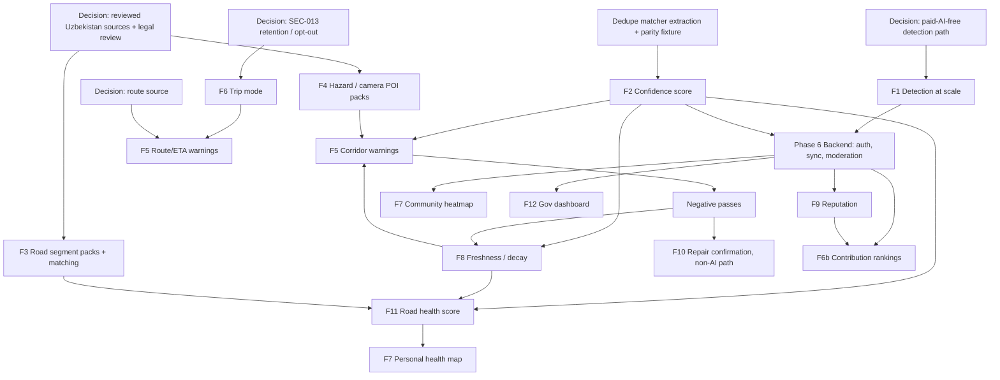

# Product implementation roadmap

Snapshot: 2026-09-14. This is a planning document grounded in the current uncommitted working tree. **It implements nothing.** No source, test, dependency, manifest, schema or security remediation was changed to produce it. Every "exists" claim below was checked against source. Every "proposed" item is new work that does not exist today.

Paths are relative to this `PROJECT_MASTER/` directory. Line numbers are from this snapshot and will drift, so function and class names are the durable references.

Protected constraints for every phase:

- **SEC-001 through SEC-016 remediations are fixed constraints.** No phase may weaken, revert or bypass them. SEC-016 (browser `#key=` fragment import removed) was resolved at source/static level by the separate security session while this roadmap was being written; this roadmap did not touch it. The next scoped security task (SEC-017) and any later SEC-* work are equally protected, and product work must not overlap files those tasks are changing. See [SECURITY_STATUS.md](SECURITY_STATUS.md).
- **The overall security gate is FAIL.** NEW-001 (AAB signature metadata) and NEW-002 (clean-build reproducibility) are open release blockers. Device, Keystore and Gradle verification is still blocked ([PROJECT_STATUS.md](PROJECT_STATUS.md)). Product work does not clear those items.
- **Full-frame invariant.** Detection, replay, evaluation and evidence must never crop, tile or mask the frame ([AGENTS.md](../AGENTS.md), enforced by [full_frame_invariant_test.py](../tests/full_frame_invariant_test.py)).
- **No commit, push, dependency change or paid call** is authorized by this document ([NEXT_STEPS.md](NEXT_STEPS.md)).

---

## 1. Current architecture relevant to the future product

The app is an Android/Capacitor client with no project-operated backend or accounts ([ARCHITECTURE.md](ARCHITECTURE.md), [README.md](../README.md)). The parts that matter for this roadmap are:

| Layer | Where it lives | Relevance |
| --- | --- | --- |
| Native foreground Drive service | [DriveForegroundService.kt](../android-app/android/app/src/main/java/dev/aiengg/potholereporter/drive/DriveForegroundService.kt) (3,093 lines) | Owns camera, GPS, the inference worker, dedupe commits and repair lookups while the WebView is in the background. This is the only component that runs while Maps is in front, so it is the natural home for in-drive warnings. |
| Native location | [NativeDriveLocationProvider.kt](../android-app/android/app/src/main/java/dev/aiengg/potholereporter/drive/NativeDriveLocationProvider.kt), [NativeGpsFixHistory.kt](../android-app/android/app/src/main/java/dev/aiengg/potholereporter/drive/NativeGpsFixHistory.kt) | Speed-aware fix intervals (`intervalMs`). The in-memory `gpsTrack` holds up to 20,000 points (`MAX_TRACK_POINTS`). A 16-fix history pairs frames with GPS. |
| Native persistence | Room `native_potholes.db`, version 7, `exportSchema = false`: [PotholeDatabase.kt](../android-app/android/app/src/main/java/dev/aiengg/potholereporter/db/PotholeDatabase.kt), [Entities.kt](../android-app/android/app/src/main/java/dev/aiengg/potholereporter/db/Entities.kt), [Daos.kt](../android-app/android/app/src/main/java/dev/aiengg/potholereporter/db/Daos.kt) | Tables: `reports`, `event_sightings`, `repair_targets`, `repair_observations`, `sessions`, `footage_segments`, `drive_keyframes`. |
| Native→Web bridge | [DriveModePlugin.kt](../android-app/android/app/src/main/java/dev/aiengg/potholereporter/plugin/DriveModePlugin.kt) (`@CapacitorPlugin(name = "DriveMode")`) | Outbox pattern: `syncReports`/`acknowledgeReports`, `syncRepairObservations`/`acknowledgeRepairObservations`, `beginRepairTargetSync`…`commitRepairTargetSync`, `getDrives`. Paged by [NativeOutboxKeysetPager.kt](../android-app/android/app/src/main/java/dev/aiengg/potholereporter/plugin/NativeOutboxKeysetPager.kt). |
| Web logic and in-page API facade | [static/standalone.js](../static/standalone.js) (11,609 lines, one IIFE) | `handle(path, opts)` (≈line 11113) is a REST-shaped local router: `/api/reports`, `/api/drives`, `/api/footage`, `/api/repair-targets`, `/api/native-report`, `/api/native-repair`, `/api/reports/{id}/condition`, `/api/export`. IndexedDB `potholes` v6 lives in `idb()` (≈line 8186). |
| Web UI | [static/index.html](../static/index.html) (5,933 lines) | Loads `vendor/leaflet.js` and `standalone.js`, then one **inline** `<script>` (line 271) that contains the UI: `I18N` (line 315), `openDash` (5452), `trackKm` (5511), `drawMap` (5519), `scatter` (5572). |
| Web asset mirrors | `static/` (canonical) → [android-app/www/](../android-app/www/), [docs/](../docs/), generated [assets/public/](../android-app/android/app/src/main/assets/public/) | All four `standalone.js`/`index.html` copies are byte-identical today. [pages_assets_test.py](../tests/pages_assets_test.py) and [sec009_csp_contract_test.py](../tests/sec009_csp_contract_test.py) enforce the mirrors and CSP. |
| Reference data pipeline | [tools/](../tools/) → content-addressed [docs/packs/v1/](../docs/packs/v1/) + small manifests | Offline builders, runtime SHA-256 verification, bounded downloads (SEC-004), cache pruning. The highway geometry tiles are the reusable road-network precedent. |

**Architectural consequence 1: CSP hash churn.** The UI is a single inline script whose SHA-256 is pinned in `script-src` in all four HTML copies (SEC-009). Any UI edit therefore requires updating that hash in four files. `script-src 'self'` already permits same-origin script files. New feature logic should go in **new small `static/*.js` files** loaded by `<script src>`, which keeps churn in the hashed inline block limited to the wiring. This is the justified reason to add modules instead of growing `standalone.js`/`index.html`.

**Architectural consequence 2: two dedupe/repair implementations.** Native and web each implement road-event matching with identical constants. Neither is shared code, and each change must be mirrored:

| Rule | Native | Web |
| --- | --- | --- |
| Road-event match | `NativeDeduplicationEngine.matchRoadEvent` (private, DAO-coupled) | `roadEventMatch` (standalone.js ≈6298) |
| Constants | `DEDUPE_ADJACENT_RADIUS_M = 12.0`, `HISTORY_RADIUS_M = 8.0`, `MISSING_HEADING_RADIUS_M = 5.0`, `SAME_DRIVE_S = 4.0`, `POOR_GPS_S = 2.0`, `HISTORY_S = 30 d` | Same values (standalone.js lines 226–231) |
| Repair pre-filter | `NativeRepairCandidateMatcher` (pure object) | `repairTargetMatch` (≈6347) |

A parity-fixture precedent already exists: [image_enhancement_parity_test.py](../tests/image_enhancement_parity_test.py) with [detection-image-enhancement-v1.json](../android-app/android/app/src/test/resources/detection-image-enhancement-v1.json). New scoring logic must follow the same pattern.

---

## 2. Existing capabilities (verified)

| Capability | Status | Evidence |
| --- | --- | --- |
| Phone-camera Drive capture with GPS association | Exists | `DriveForegroundService`, `NativeDriveCameraManager.kt`, `NativeGpsFixHistory.nearestCaptureReady` |
| Dashcam (RTSP) | Present but **disabled** by SEC-003 | [NativeRtspTransportPolicy.kt](../android-app/android/app/src/main/java/dev/aiengg/potholereporter/drive/NativeRtspTransportPolicy.kt) |
| Pothole detection | Exists, **cloud-only (OpenAI)**, user credential required | [NativeInferenceEngine.kt](../android-app/android/app/src/main/java/dev/aiengg/potholereporter/drive/NativeInferenceEngine.kt) (default model `gpt-5.6`), `analyzeImage` in standalone.js |
| Paid-inference cap | Exists: lifetime **32 requests / 32,768 output tokens** per install | [AiUsageBudget.kt](../android-app/android/app/src/main/java/dev/aiengg/potholereporter/security/AiUsageBudget.kt) `MAX_REQUESTS`, `MAX_OUTPUT_TOKENS` (SEC-006) |
| Durable replay of unanalysed frames | Exists | `drive_keyframes` table, `listPendingKeyframeSessions`, [NativeDriveWorkLedger.kt](../android-app/android/app/src/main/java/dev/aiengg/potholereporter/drive/NativeDriveWorkLedger.kt) |
| Deduplication into one canonical physical event | Exists, native and web | [NativeDeduplicationEngine.kt](../android-app/android/app/src/main/java/dev/aiengg/potholereporter/drive/NativeDeduplicationEngine.kt) `checkAndCommitReport`; standalone.js `addReportUnlessDuplicate` (≈8373). Tested by [persistent_dedupe_test.py](../tests/persistent_dedupe_test.py) and [native_duplicate_revisit_contract_test.py](../tests/native_duplicate_revisit_contract_test.py). |
| Repeat-sighting counters | Exists | `ReportEntity.seenCount`, `lastSeenAt`, `sightingDriveIdsJson`, `sourceEventKeysJson`; `event_sightings` rows; web `seen_count`, `event_sightings`, `sighting_drive_ids`, `last_seen_at` |
| Manual photos never auto-merged | Exists (deliberate) | native `captureSource == "manual"` → `null`; web `isManualCaptureSource` → `null` |
| Repair/fixed confirmation | Exists, **AI before/after**, conservative | [NativeRepairStatusEngine.kt](../android-app/android/app/src/main/java/dev/aiengg/potholereporter/drive/NativeRepairStatusEngine.kt) (`NativeRepairDecision`, `NativeRepairCandidateMatcher`, `queueObservation`); `RepairTargetEntity`/`RepairObservationEntity`; web `applyRepairObservation`; manual `/api/reports/{id}/condition`. Tested by [repair_status_test.py](../tests/repair_status_test.py). |
| Condition states | `open`, `repair_review`, `fixed` | `conditionStatus` in standalone.js ≈6238. A fresh detection resets `repair_review` to `open`. A report marked `fixed` is excluded from matching, so a recurrence becomes a new event. |
| Personal dashboard and map | Exists, local only | `openDash`: found / reported / fixed / frames / drives / **km** / MB. `drawMap` uses Leaflet `circleMarker` (orange open, green fixed) with an **offline SVG `scatter` fallback**. Tested by [contribution_map_test.py](../tests/contribution_map_test.py). |
| Drive history with GPS track | Exists, local only | Room `sessions.gpsTrackJson`, IndexedDB `drives.gps_track`. Point format `[offset, lat, lng, accuracy, speed, heading]` (SEC-013). `getDrives` bridges it; `trackKm` is the only consumer. |
| Active-time Drive limit | Exists | [DriveSessionLimitPolicy.kt](../android-app/android/app/src/main/java/dev/aiengg/potholereporter/drive/DriveSessionLimitPolicy.kt) (15/30/60/90 min per README) |
| Terminal drive summary | Exists (checked/found/already only) | [NativeDriveEndSummaryStore.kt](../android-app/android/app/src/main/java/dev/aiengg/potholereporter/drive/NativeDriveEndSummaryStore.kt) |
| Road geometry matching | Exists, **India National Highways only** | standalone.js `highwayTileIdFor`, `pointToHighwaySegment`, `matchHighwayTile` (ambiguity + heading checks), `nationalHighwayRoute` (India envelope gate); builder [build-national-highways.py](../tools/build-national-highways.py) |
| Verified, cached, bounded pack downloads | Exists | standalone.js `downloadPackResource`, `readBoundedPackBody`, `validatePackEnvelope`, `sha256Bytes`, `pruneStatePacks` (SEC-004); SHA-256 source pins (SEC-015) |
| Delete-all | Exists | web `clearAllStoredRecords` over `STORED_DATA_STORES`; native `clearNativeData`; [delete_all_data_test.py](../tests/delete_all_data_test.py), [sec002_media_cleanup_contract_test.py](../tests/sec002_media_cleanup_contract_test.py) |
| Consent before camera/location | Exists | [privacy_consent_test.py](../tests/privacy_consent_test.py) |
| Languages | en, kn, mr, bn only | `I18N` and `LANG` in index.html (lines 315, 1128). **No Uzbek or Russian.** |
| Maps handoff | Exists: opens Google Maps with an empty query | `DriveModePlugin.openMaps` (`geo:0,0?q=`) |
| Notifications | One channel, `pothole_drive_channel` | [NotificationHelper.kt](../android-app/android/app/src/main/java/dev/aiengg/potholereporter/drive/NotificationHelper.kt) |

**Verified absent.** A case-insensitive search of `static/standalone.js`, `static/index.html` and all native main sources found none of: TTS/`speechSynthesis`, vibration, routing engines (OSRM/GraphHopper/Valhalla), speed-camera/radar data, leaderboards, heatmaps, reputation/trust scores, geohash/H3 indexing, or a service worker. No Uzbekistan data exists in `data/` or `docs/packs/`. A `values-uz.json` exists only under the ignored `app/build/intermediates` output, from library resources; it is not app localization.

---

## 3. Feature-by-feature gap analysis

Each feature below lists what exists, what is missing, where it belongs, the Android/Web split, data, backend, offline behavior and privacy/security. Cross-feature dependencies are collected in §9.

### F1. Pothole detection and reporting

- **Exists:** the whole capture → cloud inference → evidence → local report → user-confirmed handoff flow (§2).
- **Missing:**
  - A detection path that works for an ordinary user at scale. The 32-request lifetime cap and the BYOK OpenAI requirement make continuous Drive economically impossible for most users. [NEXT_STEPS.md](NEXT_STEPS.md) requires an explicit paid-AI-free/manual/on-device decision.
  - Uzbekistan authority routing. `routeOfficerCore` and all packs are India-specific.
  - Uzbek/Russian strings.
- **Where:** a future on-device detector belongs behind the existing `NativeInferenceEngine` contract (`analyzeBurst` returns an outcome with `reportEntity` and `sightings`). The caller in `DriveForegroundService` would not change. Uzbekistan routing belongs in a new country route module that `routeForIssue` consults before the India-gated functions.
- **Android:** detector runtime and model asset. That is a dependency change, so it needs a separate authorized task.
- **Web:** manual photo path, language packs, country route selection.
- **Data:** unchanged `ReportEntity`. Record `detectionModel` and `promptVersion` for the new detector as already done.
- **Backend:** none.
- **Offline:** an on-device detector would make detection offline. Today detection needs network, and frames wait in `drive_keyframes`.
- **Security:** keep the SEC-005/006 bounds on any cloud path that remains. Keep the full-frame invariant. SEC-010 image bounds still apply to manual import.

### F2. Deduplication → confidence/importance

- **Exists:** canonical event merge with `seenCount`, distinct drive IDs, sightings, replay-safe source keys, and bounded per-drive sighting envelopes (64). Cross-drive matching requires GPS accuracy ≤ 15 m, age ≤ 30 d, compatible damage/size, and heading ≤ 45°.
- **FUTURE-SCORING-001 foundation:** `drive/NativeHazardScoringPolicy.kt` and `static/hazard-model.js` now derive a categorical confidence level from distinct drive IDs; one 18-case fixture tests both. `seenCount` does not add independent confidence. See [FUTURE_SCORING.md](FUTURE_SCORING.md).
- **Missing:** a product importance formula, display integration, and evidence for community-level independent confirmation. `openDash` counts reports, not confirmations.
- **Phase 1 regression checkpoints:** the 2026-09-30 FUTURE-DEDUP-001 fixture covers 20 common native/web match decisions. CORE-002 separately exercises production web paging and IndexedDB transaction completion with controlled commits/aborts, alongside native pager and acknowledgement JVM tests. The shared matcher fixture does not assert implementation-specific persistence states.
- **Where:**
  - The pure `NativeRoadEventMatcher` object is now in `drive/`; `NativeDeduplicationEngine` keeps the transaction and DAO.
  - The pure scoring modules are `drive/NativeHazardScoringPolicy.kt` and `static/hazard-model.js`; the shared fixture is `src/test/resources/hazard-scoring-v1.json`.
- **Data (Phase 1):** derive the score from existing fields; no schema change. Persist it later only if queries need it (§5).
- **Backend:** needed only for cross-user confirmation (F9, Phase 6).
- **Offline:** fully local.
- **Security:** scoring must never re-open a `fixed` event or override the manual-photo non-merge rule. The dedupe transaction and `NativeMediaFilesystemMutation.mutex` ownership (SEC-002) must stay untouched.

### F3. Road/street health ranking

- **Exists:** geometry matching machinery (`matchHighwayTile`) and its content-addressed tile pipeline, for Indian NH only. `openDash` "by area" groups by `officer_name`, which is an authority, not a road.
- **Missing:**
  - Any Uzbekistan road network.
  - A `road_segment_id` on reports.
  - Segment aggregation, exposure/traffic data, and a scoring definition.
  - Traffic/exposure data. No source exists in the repository. Without a reviewed source, "exposure" can only be proxied locally by how many of the user's own drives traversed the segment, which is biased and must be labeled that way.
- **Where:**
  - A new builder `tools/build-road-segment-packs.py`, modeled on `build-national-highways.py` (OSM extract → tiles, source receipt, SHA-256 pin).
  - A new manifest family (for example `road-segment-manifest-v1.json`) in all three manifest mirrors.
  - A matcher generalized from `matchHighwayTile` into `static/road-segments.js`.
- **Android:** match during Drive only if warnings need it (F5). Otherwise matching can happen at web import.
- **Web:** segment match at report creation or import, local aggregation, ranking UI.
- **Data:** `road_segment_id` and `road_segment_pack_version` on the report; a local `road_segments_health` derived cache (§5).
- **Backend:** multi-user rankings need aggregation (Phase 6).
- **Offline:** tiles are cached like state packs.
- **Security/licensing:** OSM data requires ODbL attribution; follow the existing [SOURCES.md](../docs/SOURCES.md) precedent. SEC-015 requires a reviewed SHA-256 pin for the source extract. SEC-004 bounds apply to downloads. Keep the existing caveat that geometry suggests, and does not prove, ownership.

### F4. Uzbekistan road hazard / speed-camera / radar infrastructure

- **Exists:** only the generic verified-pack mechanism. Nothing about cameras, radars or non-pothole hazards.
- **Missing:** everything: data sources, schema, licensing review, legal review, UI and warnings.
- **Where:**
  - A new pack family `hazard-poi` with its manifest, validator (`validateHazardPoiPack`, patterned on `validateRoadNoticePack`) and builder under `tools/`.
  - A source registry in `data/`, patterned on [tender-sources-india.json](../data/tender-sources-india.json).
- **Data (per POI):** `id`, `kind` (`fixed_speed_camera`, `average_speed_section`, `mobile_radar_reported`, `hazard_other`), `lat`/`lng`, `bearing` and `direction_scope`, optional `speed_limit_kmh`, `source_id`, `source_observed_at`, `verification_state`, `expires_at`.
- **Backend:** crowd-reported mobile radars require one (Phase 6). Static published POIs do not.
- **Offline:** packs cached.
- **Constraints:**
  - Must be framed as **incomplete, possibly outdated, informational**. The requirement explicitly forbids claiming 100% coverage.
  - The legality of radar/mobile-enforcement alerts in Uzbekistan is **not established** by anything in this repository. Before any mobile-radar feature, it needs review by qualified local stakeholders. [outputs/SECURITY_AUDIT.md](../outputs/SECURITY_AUDIT.md) §25 already requires local legal/privacy confirmation before rollout.
  - Any new download host must be added to CSP `connect-src` in all four copies (SEC-009 contract). Today only `coding-parrot.github.io/pothole-reporter/` is allowed for packs.

### F5. Dynamic pothole warnings (route, ETA, driving context)

- **Exists:**
  - The native service already receives live fixes with speed and heading while backgrounded.
  - Room holds canonical events with lat/lng/heading and a latitude-band query (`getCandidateReportsInLatitudeBand`).
  - A notification channel exists.
- **Missing:**
  - **A route source.** The app has no routing engine or navigation integration; `openMaps` hands off to Google Maps, which does not return a route. ETA-to-hazard can only be computed along the *current heading corridor* until a route source exists.
  - A lookahead policy, alert throttling, and an alert channel separate from the Drive status notification.
  - Audio/TTS.
  - Warning feedback ("still there / gone").
- **Where:** new native package `android/.../warning/`:
  - `HazardLookaheadPolicy` (pure): corridor length = f(speed); heading tolerance; minimum confidence; freshness gate; direction match using the same `headingDifference`.
  - `HazardWarningThrottle` (pure).
  - A thin service hook in `DriveForegroundService` next to the location callback.
- **Why native:** the WebView is backgrounded when Maps is in front (the `RepairTargetEntity` doc comment states this reason explicitly). Warning logic cannot live in JS.
- **Web:** settings (on/off, minimum severity, sound), and syncing warnable hazards into Room.
- **Data:** a Room mirror of warnable hazards. Reuse the existing target-sync pattern (`beginRepairTargetSync`/`appendRepairTargetBatch`/`commitRepairTargetSync`) with a new `warning_targets` table, or generalize `repair_targets`. A bounded local `warning_events` log for feedback and dedupe of alerts.
- **Backend:** none for local hazards.
- **Offline:** fully local once targets are synced.
- **Safety/privacy:**
  - No interaction may be required while moving. Feedback prompts are post-drive or voice-free single taps only when stationary; `isGenuinelyStationary` already exists.
  - Adding a notification channel or TTS changes Android behavior and must be device-verified, which is currently blocked.

### F6. Trip mode (Strava-like)

- **Exists:**
  - Per-drive track, start/end times and status in `sessions` and `drives`.
  - `trackKm` distance.
  - `getDrives` bridge.
  - Drive limit policy.
  - Terminal summary store.
- **Missing:**
  - Destination entry.
  - Route line rendering (Leaflet `polyline` is available but unused).
  - Average/moving speed and maximum speed.
  - A trip history screen distinct from the dashboard, and per-trip deletion. SEC-013 records that **no per-drive route deletion exists**.
  - Rankings (F6b below).
- **Where:**
  - Pure `static/trip-stats.js`: distance with accuracy filtering, moving time, average moving speed, and max speed computed from accurate consecutive fixes with a jump filter.
  - Native mirror only if the summary must be computed in the service. It can be computed at the web from `gps_track`.
  - UI in index.html wiring (CSP hash update).
- **Data:** add `distance_m`, `moving_time_s`, `avg_moving_speed_mps`, `max_speed_mps`, `destination_label?`, `route_retained` to `drives`/`sessions`. Derived values let the raw track be minimized later.
- **Backend:** none for personal trips.
- **Offline:** fully local.
- **Privacy (blocking):**
  - **SEC-013's product decision is open**: retention period, route-history opt-out, per-drive deletion and minimization.
  - Trip mode makes the route a user-visible feature, so this decision must be made first. [SECURITY_AUDIT.md](../outputs/SECURITY_AUDIT.md) §9 recommends omitting full routes unless justified, separating private travel from public defect coordinates, and never exposing home/work histories.
- **Speed safety:** max speed is a private personal statistic only. It must never feed rankings, badges or sharing.

**F6b. Uzbekistan user rankings.**

- **Exists:** nothing. No accounts, identity or backend.
- **Missing:** everything. Rankings are inherently multi-user, so they require Phase 6.
- **Ranking basis:** useful contribution only: independently confirmed new hazards, confirmations of others' hazards, verified repair confirmations, and coverage of unscanned segments.
- **Anti-gaming:** repeat sightings on the same drive earn nothing, and there are daily caps.
- **Excluded:** speed, distance and duration are never ranked.

### F7. Live road-health / heatmap

- **Exists:** personal point map with offline fallback.
- **Missing:** aggregation layer, segment coloring, and any shared data.
- **Where:**
  - **Personal** version: web-only, rendering local hazards aggregated per segment (F3) as Leaflet polylines or aggregated circles.
  - **Community "live"** version: requires Phase 6.
- **Offline:** personal map works offline via `scatter`. Base tiles need network; bulk offline caching of `tile.openstreetmap.org` tiles is not an acceptable use of that service, so an offline basemap needs a separate licensed source.
- **Privacy:** a community layer must publish only defect positions, never reporter tracks ([SECURITY_AUDIT.md](../outputs/SECURITY_AUDIT.md) §9, §25).

### F8. Hazard freshness/decay

- **Exists:**
  - `last_seen_at`.
  - `DEDUPE_HISTORY_S` (30 d). This is a *matching horizon*, not decay.
  - `condition_status` transitions.
- **FUTURE-SCORING-001 foundation:** pure `fresh` / `aging` / `stale` / `unknown` categorization uses an explicit reference time and caller supplied boundaries; the 18-case fixture checks both boundary transitions. Its one-day/seven-day window is test input, not product policy.
- **Missing:** selected product decay boundaries, `expired` behavior, and "not seen when passed" negative evidence. Today a pass without detection records nothing about the target.
- **Where:** the same pure scoring modules as F2 (`hazard-model.js` / `NativeHazardScoringPolicy.kt`):
  - Future decay policy may add `expired` and weighting by confidence after product thresholds are selected.
  - Negative evidence only from accurate, heading-matched, moving passes with a usable frame. Reuse the `NativeRepairCandidateMatcher` gates, because a pass without detection is weak evidence.
- **Data:** a `negative_pass_count` and `last_negative_pass_at` per hazard, from a bounded `hazard_passes` log.
- **Offline:** local.
- **Security:** decay must never automatically mark `fixed`. Only the existing strict repair path or an explicit user action may. This preserves the rule stated in `RepairTargetEntity`'s doc comment.

### F9. User trust/reputation score

- **Exists:** nothing. There is no identity.
- **Missing:** everything.
- **Local-only phase:** a *personal* contribution ledger is possible (F6b inputs) but is not a trust score, because nobody else consumes it.
- **Real reputation:** requires backend accounts, server-side verification of contributions, moderation and abuse controls ([SECURITY_AUDIT.md](../outputs/SECURITY_AUDIT.md) §20, §25).
- **Where:** a backend service (Phase 6). The client only displays it.
- **Privacy:** reputation must not be derivable from, or leak, trip data.

### F10. Repair/fixed confirmation

- **Exists:** strict AI before/after verification, a `repair_review` state, a manual condition route, the outbox, and tests (§2).
- **Missing:**
  - A non-AI confirmation path compatible with the paid-AI-free direction: user "fixed?" confirmation with photo, reusing `/api/reports/{id}/condition` rules.
  - Multi-user repair consensus (Phase 6).
  - Negative-pass input to `repair_review` (F8).
- **Where:** extend existing code; do not replace it.
- **Data:** add `condition_source` values (the field already exists on web records).
- **Security:** keep `NativeRepairTime.isStrictlyAfter` and the unique `sourceEventKey` idempotency. SEC-010 bounds apply to repair evidence (`decodeRepairEvidence`, `REPAIR_EVIDENCE_*` limits).

### F11. Road health score

- **Exists:** inputs only: size estimate (`size`, labeled a low-confidence visual estimate), damage type, `seen_count`, `condition_status`.
- **Missing:** the formula, segment length normalization (F3), and exposure.
- **Proposed definition (owner-tunable, not implemented):**
  - `segment_score = 100 − clamp(Σ hazard_weight / km)`.
  - `hazard_weight = severity(size, damage_type) × confidence(F2) × freshness(F8)`, with fixed hazards weighted 0.
  - Exposure is shown alongside the score, not multiplied into it, until a reviewed traffic source exists.
- **Where:** `static/hazard-model.js` (per hazard) and `static/road-segments.js` (per segment).
- **Honesty:** the size is not a physical measurement (README and `measurementProvenance`), and the UI must say so.

### F12. Admin/government dashboard

- **Exists:** nothing. [BMC_PILOT.md](../docs/BMC_PILOT.md) is a pilot document, not a dashboard.
- **Missing:** backend, roles/object authorization, moderation, export, audit logs.
- **Where:** a separate web application against the Phase 6 API. It must **not** be added into the citizen WebView bundle, because the privileged Capacitor WebView and its CSP are a security boundary (SEC-009).
- **Prerequisite:** the Phase 6 backend with the audit's controls (§25 and the security gate item 7).

### F13. Offline-first operation

- **Exists:**
  - Local-first storage on both sides.
  - Durable keyframe replay.
  - Outbox with acknowledgement.
  - Verified pack cache with pruning.
  - Offline map fallback.
  - Transaction-commit-correct IndexedDB writes (`op`).
- **Missing:**
  - Offline detection (F1).
  - Offline geocoding and routing: Nominatim and India GIS are online.
  - An app-shell cache for the web build. The Android bundle is local, so this is not needed for the Android app.
  - Pack prefetch per region.
  - A future server sync queue.
- See §6.

---

## 4. Recommended architecture

Extend the existing layering. Do not introduce a framework or restructure the tree.

```
android/.../drive/        (existing) capture, inference, dedupe/repair transactions, pure NativeRoadEventMatcher and NativeHazardScoringPolicy
android/.../warning/      (new) HazardLookaheadPolicy, HazardWarningThrottle, WarningNotifier
android/.../trip/         (new, pure Kotlin, only if the service must compute stats) TripStatsPolicy
android/.../db/           (existing) + migration 7→8 for new tables
android/.../plugin/       (existing) + warning-target sync methods on DriveModePlugin

static/standalone.js      (existing) handle() routes and IndexedDB stay here; only thin calls added
static/hazard-model.js    (existing foundation) confidence, freshness, severity — pure, no DOM, no network
static/road-segments.js   (new) segment pack validation and matching (generalized matchHighwayTile)
static/trip-stats.js      (new) distance/moving time/avg/max from gps_track — pure
static/index.html         (existing) UI wiring only; CSP hash updated in 4 copies per change

tools/build-road-segment-packs.py   (new) modeled on build-national-highways.py
tools/build-hazard-poi-packs.py     (new) modeled on build-gepnic-road-notice-packs.py
data/uz/…                           (new) reviewed source registry and receipts

[future, separate repo or top-level dir] backend/ and admin-dashboard/
```

Principles:

1. **Pure policy objects first.** New logic lands as side-effect-free functions with JVM/Node/Playwright tests, mirroring `NativeRepairCandidateMatcher`, `DriveSessionLimitPolicy` and `NativeLiveInferencePolicy`. Transactions, bridges and UI call them.
2. **One rule, two runtimes, one fixture.** Any rule that exists natively and in JS gets a shared JSON fixture checked by both. This follows the precedent in `image_enhancement_parity_test.py`.
3. **Native owns anything that runs while the WebView is backgrounded.** That covers warnings, pass logging and live segment lookups. Web owns review, aggregation, history and settings.
4. **Packs for reference data, backend only for multi-user data.** Road networks and published camera lists are packs. Rankings, reputation, community heatmaps, crowd radars and the government dashboard are backend.
5. **`handle()` is the future sync seam.** Its REST-shaped paths let a later remote sync client sit beside local IndexedDB without changing UI call sites. Local stays authoritative; remote is an opt-in replica.

---

## 5. Data model evolution

Every step must follow these rules:

- Add fields with fail-closed defaults, as `MIGRATION_5_6` and `MIGRATION_6_7` already do, with a migration test like [ReportSchemaV6MigrationTest.kt](../android-app/android/app/src/test/java/dev/aiengg/potholereporter/db/ReportSchemaV6MigrationTest.kt).
- Bump IndexedDB with additive `onupgradeneeded` guards.
- Extend **both** delete-all paths: `STORED_DATA_STORES` plus `clearAllStoredRecords`, and `clearNativeData`. Tests: `delete_all_data_test.py` and the SEC-002 contract.
- `exportSchema = false` today means schema drift is caught only by migration tests. Enabling schema export is a build-configuration change and needs its own authorized task.

| Step | Native (Room) | Web (IndexedDB) | Notes |
| --- | --- | --- | --- |
| S0 (now) | v7 as described | `potholes` v6: `reports`(by_lat, by_drive, by_sighting_drive), `drives`, `footage`, `state_packs` | Canonical report row **is** the physical hazard today. |
| S1 Hazard scoring (derived) | none | none | Foundation computes categorical confidence from distinct drive IDs, freshness from `last_seen_at` with caller supplied boundaries, and severity from `size`; repair state is separate. No stored score, GPS/assessment weighting, or product cutoff exists yet. |
| S2 Trip stats + retention | `sessions` + `distanceM`, `movingTimeS`, `avgMovingSpeedMps`, `maxSpeedMps`, `routeRetained` | `drives` same fields (snake_case) | Fields derived once; enables track minimization when the SEC-013 decision is made. |
| S3 Road segments | `reports` + `roadSegmentId`, `roadSegmentPackVersion` (nullable) | `reports` same; new index `by_segment` | Nullable; unmatched stays null (fail closed). |
| S4 Warnings | new `warning_targets` (hazard mirror: id, lat, lng, heading, confidence, freshness, kind, segmentId), `warning_events` (bounded log) | settings only | Sync uses the existing begin/append/commit target pattern. |
| S5 Negative passes | new `hazard_passes` (bounded, outbox + ack like `repair_observations`) | `reports` + `negative_pass_count`, `last_negative_pass_at` | Never transitions to `fixed`. |
| S6 Hazard POI packs | none (read-only pack cache; native mirror only for warnings via `warning_targets.kind`) | reuse `state_packs` cache with a new `cache_key` namespace | Provenance and expiry in pack. |
| S7 Split hazard from report (only if needed) | new `hazards` table; `reports.hazardId` | new `hazards` store | Only when multiple user reports per hazard or server IDs require it. Do not do this earlier. |
| S8 Sync metadata (Phase 6) | `remoteId`, `syncState`, `sharedAt` on shareable rows only | same | Trips are never in the sync set by default. |

---

## 6. Offline-first strategy

| Concern | Current behavior | Strategy |
| --- | --- | --- |
| Capture while offline | Frames persist to `drive_keyframes`; replay after the drive | Keep. On-device detection (F1 decision) removes the network dependency. |
| Detection | Cloud only | Decision gate. Until it is resolved, offline Drive records evidence and defers analysis. |
| Report storage | Room + IndexedDB, transaction-commit-correct | Keep. All new stores follow the `op()` commit semantics and `NativeOutboxKeysetPager` paging. |
| Reference data | Verified packs cached, pruned by `max_unused_days` | Add region prefetch ("download Tashkent region") using the same bounded, verified path. |
| Map | Leaflet tiles online; SVG `scatter` offline | Keep the fallback. A licensed offline basemap is a separate decision. Segment health polylines draw on the fallback too. |
| Geocoding | Nominatim online | Store raw coordinates first (already true); geocode lazily. Road names can come from the segment pack. |
| Warnings | n/a | Entirely local from `warning_targets`; no network in the alert path. |
| Future sync | n/a | Outbox with idempotent keys (already modeled by `sourceEventKey` uniqueness), user-initiated or opt-in, never blocking local operation. |

---

## 7. Backend/API boundary

**Current fact:** no project backend exists or is operated ([ARCHITECTURE.md](ARCHITECTURE.md)). External calls are OpenAI, Nominatim, KGIS/Telangana GIS, OSM tiles and GitHub Pages packs, all allow-listed in CSP `connect-src`.

**Stay client-only (no backend):**

- F1 (local detection path)
- F2 and F8 (local scoring)
- F3 and F11 personal segment health
- F5 warnings from own or pack data
- F6 personal trips
- F7 personal map
- F10 personal repair confirmation
- F13 offline

**Require a backend (Phase 6+):**

- Cross-user dedupe/confirmation
- F6b rankings
- F7 community heatmap
- F9 reputation
- Crowd-reported mobile radars (F4)
- Multi-user repair consensus
- F12 government dashboard

**Minimum backend contract when it is chosen.** Follow the already recorded recommendations; do not invent a provider ([ARCHITECTURE.md](ARCHITECTURE.md) last section; [SECURITY_AUDIT.md](../outputs/SECURITY_AUDIT.md) §25, gate item 7):

- Authenticated accounts; role and object authorization.
- Scoped, validated, private media uploads.
- **Public hazard positions separated from private trips and reporter identity.**
- Quotas, moderation, abuse controls, retention and deletion rules.
- Server-side dedupe that reuses the same matching rules (the shared fixtures from Phase 1 become the server's conformance tests).

**Client integration:**

- A sync module beside `handle()`.
- A new CSP `connect-src` host in all four HTML copies.
- A privacy-notice update ([docs/privacy.html](../docs/privacy.html) currently states there is no project server).
- Consent versioning (`data_notice_version` exists in index.html settings keys).

---

## 8. Android/WebView boundary

| Responsibility | Native | WebView |
| --- | --- | --- |
| Camera, GPS, foreground service, battery limit | ✔ (existing) | — |
| Live detection commit + dedupe transaction | ✔ (existing) | Manual/replay path (existing) |
| Warnings while Maps is in front | ✔ (new `warning/`) | Settings UI only |
| Negative-pass logging | ✔ (new, outbox) | Apply on import |
| Hazard scoring | Pure mirror (for warning gating) | ✔ Authoritative for display |
| Road segment matching | Only if warnings need live segment IDs | ✔ At report creation/import |
| Trip stats | Optional mirror | ✔ From `gps_track` |
| Trip history, dashboard, map, rankings UI | — | ✔ |
| Pack download and verification | — | ✔ (existing SEC-004 path) |
| Credentials | ✔ (SEC-001 broker; never returns plaintext) | Session-only in browser; Settings entry is the only credential source after SEC-016; **no product feature changes this** |
| Delete-all | ✔ `clearNativeData` | ✔ `clearAllStoredRecords` |

Bridge rules for new methods on `DriveModePlugin`:

- Paged keyset outbox calls.
- Explicit acknowledgement after IndexedDB commit, following `NativeAcknowledgementCommit.kt`.
- Bounded payloads, following `NativeBridgeImageBudget.kt`.
- No bulk track or photo materialization, following the `ReportSyncCandidate` projection comment.

---

## 9. Feature dependency graph



Hard blockers, meaning decisions this repository cannot make on its own:

| ID | Decision | Blocks |
| --- | --- | --- |
| D0 | Detection path. NEXT_STEPS requires an explicit decision; the 32-request cap makes cloud-only non-viable at scale. | F1 at scale, and every crowd feature whose value depends on volume |
| D1 | SEC-013 retention/opt-out/minimization | F6 |
| D2 | Reviewed Uzbekistan road, authority and POI sources, licensing, and local legal review of enforcement alerts | F3, F4 |
| RS | Route source (in-app routing data vs. external navigation integration) | Route-aware ETA warnings |
| — | NEW-001/NEW-002 and blocked device verification | Any *release* of the above, not source work |

---

## 10. Recommended implementation phases

Phases are ordered by technical dependency. Each phase ends with its tests green and the mirrors/CSP contracts passing. None starts before the owner authorizes it.

**Phase 0: Decisions and gates (documentation only).** Record D0, D1, D2 and RS. Continue the security queue per [PROJECT_STATUS.md](PROJECT_STATUS.md); product work proceeds in parallel only at source level and does not touch SEC-* files.

**Phase 1: Local hazard intelligence foundation.** No schema change, no network, no new dependencies.

1. Extract a pure `NativeRoadEventMatcher` from `NativeDeduplicationEngine.matchRoadEvent` without changing behavior.
2. Add a shared dedupe parity fixture exercised by the JVM test and the JS `roadEventMatch`.
3. Completed foundation: `static/hazard-model.js` and `drive/NativeHazardScoringPolicy.kt` for categorical confidence, freshness and visual severity, with an 18-case shared fixture. Product cutoffs and UI use remain separate decisions.
4. Show confidence and freshness on the existing report detail, and use them for marker styling in `drawMap`/`scatter`.
5. Add `static/trip-stats.js` and show private per-drive distance, moving time, average and max speed in the existing drive history. Display only; no new persistence until D1.

*Why first:* it reuses the most existing code and has the lowest risk. The later warning, road-health and backend phases all depend on it.

**Phase 2: Trip mode and route privacy** (after D1).

- S2 schema.
- Per-drive deletion and a route-retention setting.
- Trip history screen.
- Leaflet polyline for retained routes.
- Optional destination label (text only; no routing).

**Phase 3: Uzbekistan road network and road health** (after D2).

- Source review and SHA-256 pin.
- `build-road-segment-packs.py`.
- Manifest and validator.
- `road-segments.js` matching.
- S3 schema.
- Segment health score and personal health map.

**Phase 4: Native corridor warnings.**

- S4 schema and warning-target sync.
- `HazardLookaheadPolicy` and throttle.
- Separate notification channel; optional sound.
- Post-drive feedback.
- S5 negative passes feeding freshness and `repair_review`.
- Device verification is required before release and is currently blocked.

**Phase 5: Hazard/camera POI packs** (after D2 legal review). Pack family, disclaimers, expiry, and integration into warnings as a distinct `kind`. Published or official sources only; no crowd radar.

**Phase 6: Opt-in shared backend** (only if chosen).

- Auth, private media and moderation per the audit.
- Hazard sync; server dedupe using the Phase 1 fixtures.
- Contribution rankings (never speed).
- Reputation.
- Community heatmap.
- Multi-user repair consensus.
- Crowd-reported radars, if legally cleared.

**Phase 7: Government/admin dashboard.** Separate web app against Phase 6 APIs, with role-based access, exports and an audit log.

**Cross-cutting (any phase):** Uzbek and Russian strings in `I18N`, and an Uzbekistan route module ahead of the India-gated routes. These depend on D2 for authority data; the language strings do not.

---

## 11. Testing strategy

Use existing harnesses only; no new dependencies.

| Layer | Harness (existing) | Apply to |
| --- | --- | --- |
| Pure Kotlin policies | JVM unit tests in [src/test/](../android-app/android/app/src/test/java/dev/aiengg/potholereporter/) (e.g. `NativeRepairCandidateMatcherTest.kt`, `DriveSessionLimitPolicyTest.kt`) | `NativeRoadEventMatcher`, `HazardScoringPolicy`, `HazardLookaheadPolicy`, `TripStatsPolicy` |
| JS/native parity | Fixture JSON + [image_enhancement_parity_test.py](../tests/image_enhancement_parity_test.py) pattern | Dedupe match, scoring, freshness |
| Browser behavior | Playwright via [serve_app.py](../tests/serve_app.py) and [run-all.sh](../tests/run-all.sh) (`/web-app/` serves `static/`) | Dashboard, trip history, health map, offline fallback (as in `contribution_map_test.py`) |
| Source contracts | Static Python contract tests (e.g. `native_duplicate_revisit_contract_test.py`) | Bridge acknowledgement, bounded paging, warning never marks `fixed` |
| Migrations | `ReportSchemaV6MigrationTest.kt` pattern | Room 7→8+ |
| Delete-all | `delete_all_data_test.py`, `sec002_media_cleanup_contract_test.py` | Every new store/table |
| Mirrors and CSP | `pages_assets_test.py`, `sec009_csp_contract_test.py` | Every new `static/*.js` file and every inline-script change |
| Packs | `national_highway_pack_test.py`, `state_pack_validation_test.py`, `released_pack_compatibility_test.py` | Road-segment and POI packs |
| Invariants | `full_frame_invariant_test.py`, `privacy_consent_test.py` | Must stay green in every phase |

Regression rules:

- Existing dedupe/repair tests must pass **unchanged** after the Phase 1 extraction.
- The recorded Windows limitations (CRLF pack hashes, POSIX pruner tests, Gradle JAR access) are not relaxed ([PROJECT_STATUS.md](PROJECT_STATUS.md)). Use JVM/Playwright evidence at source level, and do not retry blocked device work per task.

---

## 12. Risks and blockers

| Risk | Evidence | Mitigation |
| --- | --- | --- |
| Detection cost makes crowd features empty | `AiUsageBudget.MAX_REQUESTS = 32` lifetime | Resolve D0 before investing in Phase 6 |
| Dedupe drift between native and web | Two independent implementations with copied constants | Phase 1 parity fixture before any rule change |
| CSP hash churn and mirror errors | Inline UI script hashed in 4 copies | Put logic in `static/*.js`; run the SEC-009 and pages contracts on every change |
| Route history privacy | SEC-013 open decision; audit §9 | D1 before Phase 2; private-by-default trips |
| Speed-encouraging gamification | Product requirement | Speed never ranked or shared; contribution-only scoring |
| Legal status of radar alerts in Uzbekistan | Not established anywhere in repo; audit §25 | D2 legal review; published/official sources only until cleared |
| False warnings erode trust / distract drivers | No warning code exists | Conservative thresholds reusing strict GPS/heading gates; throttle; no interaction while moving |
| Overclaiming coverage/accuracy | README/"no guess" culture; requirement | Mandatory incomplete-data disclaimers; freshness shown; fail-closed matching |
| Data licensing (OSM ODbL, government sources) | Existing `SOURCES.md` precedent | Source receipts + attribution per pack |
| Release blocked regardless of features | NEW-001, NEW-002, device verification blocked | Treat as release gate, not feature gate |
| `standalone.js` / `DriveForegroundService.kt` growth | 11.6k and 3.1k lines | New modules/packages; service gets thin hooks only |
| Room schema drift unnoticed | `exportSchema = false` | Migration tests per step; schema export is a separate authorized build change |

---

## 13. What should NOT be rewritten

- **`NativeDeduplicationEngine.checkAndCommitReport` transaction and mutex ownership.** Extract the pure matcher only. SEC-002 evidence ownership depends on this boundary.
- **`NativeRepairStatusEngine` / `NativeRepairDecision` / `NativeRepairCandidateMatcher`.** Add non-AI inputs beside them, not in place of them.
- **The outbox/acknowledgement bridge** (`syncReports`, `acknowledgeReports`, repair target/observation sync, `NativeOutboxKeysetPager`, `NativeAcknowledgementCommit`). Reuse its pattern for warnings and passes.
- **The pack pipeline:** bounded download, SHA-256 envelope validation, cache and prune (SEC-004, SEC-015). New pack families plug into it.
- **`idb()`/`op()` commit semantics and `clearAllStoredRecords` single-transaction delete.** Extend the store list only.
- **`handle()` routing facade.** Add routes; keep it as the future sync seam.
- **Credential broker and native secret store** (SEC-001, SEC-006). No product feature needs to touch them, including the SEC-016 fragment-stripping behavior.
- **CSP, FileProvider paths, RTSP policy, AI budget** (SEC-009, SEC-014, SEC-003, SEC-006).
- **The full-frame capture/preparation path** ([AGENTS.md](../AGENTS.md)).
- **India routing and data.** Leave it intact and add Uzbekistan beside it. NEXT_STEPS forbids relabeling Indian routing.
- **The source tree layout.** `PROJECT_MASTER/` stays documentation-only.

---

## 14. First 10 concrete implementation tasks

Each is a separately authorized, source-level task. None touches SEC-* remediation files, dependencies or release configuration.

1. **Record product decisions D0, D1, D2 and RS** in a new `PROJECT_MASTER/PRODUCT_DECISIONS.md`: detection path, route retention/opt-out, Uzbekistan source/legal review owner, route source. *Output:* documentation. *Unblocks:* Phases 2–6.
2. **Completed for FUTURE-DEDUP-001:** extracted pure `drive/NativeRoadEventMatcher.kt` from `NativeDeduplicationEngine.matchRoadEvent`. The engine retains DAO reads, transaction and mutex.
3. **Completed for FUTURE-DEDUP-001:** `android-app/android/app/src/test/resources/road-event-match-v1.json` is the single 20-case match-decision fixture used by the JVM and Node tests. The existing web persistence test and native ownership contracts cover storage behavior separately. This fixture does not assert fixed-state recurrence because native reports have no matching condition field; web also recognizes `manual_*` capture sources and rejects non-finite coordinates, while native's matcher only treats literal `manual` and null coordinates specially. These differences were not changed by this task.
4. **Foundation completed for FUTURE-SCORING-001:** `static/hazard-model.js` and `drive/NativeHazardScoringPolicy.kt` derive categorical confidence, freshness and visual severity from existing report fields, using one 18-case shared fixture. Product freshness cutoffs and warning/map use remain unselected. Add the script to the HTML mirrors only when a production consumer is implemented; update CSP if an inline block changes.
5. **Display confidence and freshness** in the existing report detail and map markers (`drawMap`, `scatter`). Update the inline-script CSP hash in four copies. *Tests:* extend `contribution_map_test.py`; SEC-009 and pages contracts.
6. **Implement `static/trip-stats.js`** over the existing `gps_track` format `[offset, lat, lng, accuracy, speed, heading]`: accuracy-filtered distance (consistent with `trackKm`), moving time, average moving speed, and max speed with a jump filter. Display privately per drive. *Tests:* Node unit tests with synthetic tracks; Playwright for display.
7. **Draft the Room 7→8 and IndexedDB 6→7 migration plan** for S2–S4 fields and tables, including `clearNativeData` and `STORED_DATA_STORES` coverage and the tests to extend. Documentation first; code after D1.
8. **Write the Uzbekistan road-segment pack specification**: tile format `pothole-road-segment-tile` derived from the highway tile schema, a segment ID scheme, source receipt fields, a SHA-256 pin procedure mirroring `pull-national-highways.sh`, and the CSP host impact (none if hosted with existing packs).
9. **Implement pure `warning/HazardLookaheadPolicy.kt`** with JVM tests only, and no service or notification wiring: speed-based corridor, heading gate (reuse `NativeDeduplicationEngine.headingDifference`), confidence/freshness gates, and throttling. It must be proven never to change report or condition state.
10. **Write the hazard/speed-camera POI pack schema and contract test skeleton** with no data. Required fields cover provenance, `verification_state`, `expires_at` and a mandatory disclaimer string. The validator must reject packs lacking provenance or expiry. Record that the mobile-radar category stays disabled until the D2 legal review.

---

## Verification performed for this document

- All repository paths linked or named in backticks as existing were checked for existence after writing (see the final session report). Items marked "new"/"proposed" do not exist and are not claimed to.
- Existing-capability claims were read from source: Room entities, DAOs, migrations and version; dedupe and repair engines; service call sites; plugin method list and `getDrives`/`openMaps`; AI budget constants; location track bound; IndexedDB schema and stores; JS dedupe/repair constants and functions; `handle()` routes; dashboard/map/`trackKm`; I18N languages; CSP; mirror byte-equality; test purposes and `run-all.sh`.
- The absence claims were checked by a search over the web sources and native main sources.
- Security statements were cross-checked against [SECURITY_STATUS.md](SECURITY_STATUS.md), [PROJECT_STATUS.md](PROJECT_STATUS.md), [SECURITY_REMEDIATION_SEC013.md](SECURITY_REMEDIATION_SEC013.md) and the audit's §9/§25 headings; no status was changed or reinterpreted.
